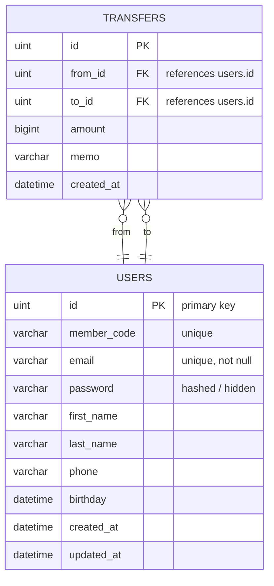

## Database ER Diagram

This file contains a Mermaid ER diagram generated from the project's Go models (`models/user.go` and `models/transfer.go`). It shows entities, fields, constraints, and the relationships between them.

### Notes
- Entities and fields were derived directly from `models/user.go` and `models/transfer.go`.
- The database is migrated using GORM in `db/db.go` (AutoMigrate for `User` and `Transfer`).
- `from_id` and `to_id` in `TRANSFERS` are foreign keys to `USERS.id` (each transfer has one sender and one receiver; a user can send or receive many transfers).

### Requirements coverage
- Create ER diagram from models: Done (diagram above).
- Output path `docs/database.md`: Done.
